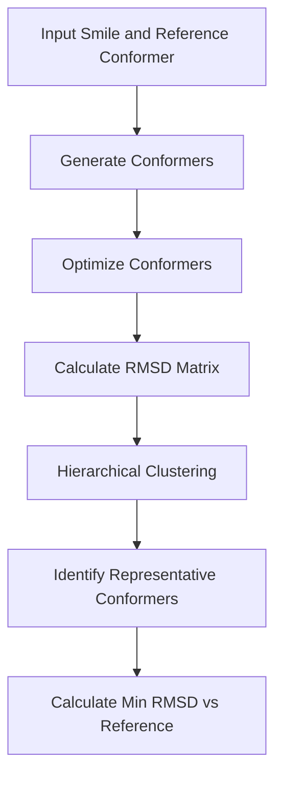

# atk-conformer-generation-pipeline

## Purpose

This project provides a comprehensive pipeline for generating, optimizing, and clustering molecular conformers from SMILES strings. It automates the process of identifying representative conformers and calculating key metrics like pairwise RMSD and finding minimum RMSD between a reference conformer and cluster representatives.

## Pipeline Overview



## Installation

First, ensure you have OpenBabel installed. You can install it using the following command:

```bash
apt-get install openbabel
```

Then, install the package using pip:

```bash
pip install atk-conformer-generation-pipeline
```

## Usage

### Main Command: `run_pipeline`

The `run_pipeline` command executes the entire conformer generation and analysis pipeline.

```bash
run_pipeline <ref_confo_path> "<inp_smiles>" --num-conf <num_conf> --num-cluster <num_clusters>
```

- `<ref_confo_path>`: Path to the reference conformer file
- `"<inp_smiles>"`: SMILES string of the input molecule
- `<num_conf>`: Number of conformers to generate
- `<num_clusters>`: Number of clusters to make.
## Key Functions

1. `time_rand_seed()`: Generates a random seed based on the current time.
2. `display_2d_structure(smiles, filename)`: Generates and saves a 2D structure image of a molecule.
3. `remove_path(path)` and `remove_paths(paths)`: Remove files or directories.
4. `generate_conformers(smiles, num_conf, num_threads=10)`: Generates conformers for a given molecule.
5. `mmff_optimize_conformers(opt_mol)`: Optimizes conformers using the MMFF94 force field.
6. `save_conformers_to_sdf(mol, filename)`: Saves conformers to an SDF file.
7. `calculate_tanimoto_similarity(smiles1, smiles2)`: Computes Tanimoto similarity between two molecules.
8. `convert_conformers_to_smiles(opt_conf_sdf, opt_conf_smiles_file)`: Converts 3D conformers to SMILES strings.
9. `calculate_rmsd(input_sdf, output_file)`: Calculates RMSD between geometries in an SDF file.
10. `process_conformers(...)`: Processes optimized conformers, calculates similarities, and separates feasible/infeasible geometries.
11. `calculate_relative_energies(energy_DF, output_csv)`: Computes and saves relative energies of conformers.
12. `write_cluster_representatives(...)`: Writes cluster representative conformers to SDF files.
13. `calculate_min_rmsd(...)`: Calculates minimum RMSD between a reference conformer and cluster representatives.

For detailed usage of each function, please refer to the function documentation in the source code.


# Full details on functions

# Functions

## 1. Function: `time_rand_seed`

### Description
The `time_rand_seed` function generates a random seed based on the current time. The seed is derived from the decimal part of the current time, ensuring that it is unique and unpredictable.

### Usage

```python
from atk_conformer_generation_pipeline.utils import time_rand_seed

seed = time_rand_seed()
print(seed)
```

## 2. Function: `display_2d_structure`

### Description
The `display_2d_structure` function generates and displays the 2D structure of a molecule based on its SMILES string. The function converts the SMILES string into a molecule object, computes its 2D coordinates, and then draws and saves the molecule's 2D structure as an image.

### Usage

```python
from atk_conformer_generation_pipeline.utils import display_2d_structure

smiles = "CCO"
display_2d_structure(smiles, filename="ethanol.png")
```

## 3. Function: `remove_path`

### Description
The `remove_path` function removes a file or directory if it exists. It checks the type of the path (file or directory) and deletes it accordingly. If the path does not exist, the function will notify the user.

### Usage

```python
from atk_conformer_generation_pipeline.utils import remove_path

path_to_remove = "/path/to/file_or_directory"
remove_path(path_to_remove)
```

## 4. Function: `remove_paths`

### Description
The `remove_paths` function removes multiple files or directories specified in a list. It iterates through the provided paths, checking each one and deleting it if it exists. If a path does not exist, it prints a message indicating so.

### Usage

```python
from typing import List
from atk_conformer_generation_pipeline.utils import remove_paths

paths_to_remove = [
    "/path/to/file1.txt",
    "/path/to/file2.txt",
    "/path/to/directory1"
]
remove_paths(paths_to_remove)
```

## 5. Function: `generate_conformers`

### Description
The `generate_conformers` function generates multiple conformers for a given molecule using the RDKit-ETKDG method. The function converts a SMILES string into a molecule object, adds hydrogens, and generates conformers based on the provided parameters.

### Usage

```python
from atk_conformer_generation_pipeline.utils import generate_conformers

smiles_string = "CCO"
num_conformers = 10
conformers_mol = generate_conformers(smiles_string, num_conf=num_conformers)
```

### Arguments
- smiles (str): The SMILES string representing the molecule for which conformers are to be generated.
- num_conf (int): The number of conformers to generate.
- num_threads (int, optional): The number of threads to use for conformer generation. Default is 10.

### Returns
- Chem.Mol: The RDKit molecule object with generated conformers.


## 6. Function: `mmff_optimize_conformers`

### Description
The `mmff_optimize_conformers` function optimizes the conformers of a molecule using the MMFF94 force field from RDKit. It updates the molecule object with optimized conformers and calculates the MMFF energies for each conformer.

### Usage

```python
from atk_conformer_generation_pipeline.utils import mmff_optimize_conformers

# Example molecule with conformers
molecule_with_conformers = Chem.MolFromSmiles("CCO")  # Replace with a molecule containing conformers
optimized_mol, energies = mmff_optimize_conformers(molecule_with_conformers)
```

### Arguments
- opt_mol (Chem.Mol): The RDKit molecule object that contains conformers to be optimized.

### Returns
- `Tuple[Chem.Mol, Dict[int, float]]`: A tuple containing:
  - `Chem.Mol`: The RDKit molecule object with optimized conformers.
  - `Dict[int, float]`: A dictionary where keys are conformer indices and values are the MMFF energies of the corresponding conformers.


## 7. Function: `save_conformers_to_sdf`

### Description
The `save_conformers_to_sdf` function saves a molecule with multiple conformers to an SDF (Structure Data File) file. Each conformer is labeled with its conformer ID in the file.

### Usage

```python
from rdkit import Chem
from rdkit.Chem import AllChem
from atk_conformer_generation_pipeline.utils import save_conformers_to_sdf

# Example molecule with conformers
molecule_with_conformers = Chem.MolFromSmiles("CCO")  # Replace with a molecule containing conformers

# Save the conformers to an SDF file
save_conformers_to_sdf(molecule_with_conformers, "conformers.sdf")
```

### Arguments
- mol (Chem.Mol): The RDKit molecule object containing multiple conformers to be saved.
- filename (str): The name of the output SDF file where the conformers will be saved.

## 8. Function: `calculate_tanimoto_similarity`

### Description
The `calculate_tanimoto_similarity` function computes the Tanimoto similarity coefficient between two molecules represented by their SMILES (Simplified Molecular Input Line Entry System) strings. This coefficient measures the similarity between two sets of molecular fingerprints.

### Usage

```python
from atk_conformer_generation_pipeline.utils import calculate_tanimoto_similarity

# Example SMILES strings
smiles1 = "CCO"  # Ethanol
smiles2 = "CCCO"  # Propanol

# Calculate Tanimoto similarity between the two molecules
similarity = calculate_tanimoto_similarity(smiles1, smiles2)
print(f"Tanimoto Similarity: {similarity}")
```
### Parameters
- smiles1 (str): The SMILES string of the first molecule.
- smiles2 (str): The SMILES string of the second molecule.

### Returns
- float: The Tanimoto similarity coefficient between the two molecules. Returns None if either SMILES string is invalid.

## 9. Function: `convert_conformers_to_smiles`

### Description
The `convert_conformers_to_smiles` function converts 3D geometries of conformers from an SDF file to SMILES strings and saves the result to a specified file. It uses the `obabel` tool for the conversion and performs some file manipulations to achieve the desired output.

### Usage

```python
from atk_conformer_generation_pipeline.utils import convert_conformers_to_smiles

# Define paths to the input SDF file and the output SMILES file
opt_conf_sdf = "optimized_conformers.sdf"
opt_conf_smiles_file = "conformers.smiles"

# Convert conformers to SMILES and save to file
convert_conformers_to_smiles(opt_conf_sdf, opt_conf_smiles_file)
```

### Parameters
- opt_conf_sdf (str): The path to the SDF file containing the optimized conformers.
- opt_conf_smiles_file (str): The path where the SMILES output should be saved.

## 10. Function: `calculate_rmsd`

### Description
The `calculate_rmsd` function uses the Open Babel `obrms` command to calculate the Root Mean Square Deviation (RMSD) between the geometries present in an SDF file. The results are appended to a specified output file.

### Usage

```python
from atk_conformer_generation_pipeline.utils import calculate_rmsd

# Define paths to the input SDF file and the output file
input_sdf = "geometries.sdf"
output_file = "rmsd_results.txt"

# Calculate RMSD and append results to the output file
calculate_rmsd(input_sdf, output_file)
```

### Parameters
- input_sdf (str): The path to the SDF file containing the geometries for RMSD calculation.
- output_file (str): The path to the file where the RMSD results will be appended.


## 11. Function: `process_conformers`

### Description
The `process_conformers` function processes optimized conformers to calculate Tanimoto similarity between each conformer and the original molecule. It separates the conformers into feasible and infeasible geometries, saves them into respective SDF files, and exports the similarity results and infeasible geometries into CSV files.and return the feasiable and infeasiable dataframes.

### Usage

```python
from atk_conformer_generation_pipeline.utils import process_conformers

# Define paths and parameters
opt_conf_SMILES_file = "conformers_SMILES.txt"
opt_conf_sdf = "optimized_conformers.sdf"
feasible_geometries_sdf = "feasible_geometries.sdf"
infeasible_geometries_sdf = "infeasible_geometries.sdf"
similarity_output_csv = "tanimoto_similarity.csv"
infeasible_geometries_csv = "infeasible_geometries.csv"
inp_smiles = "C1=CC=CC=C1"  # Example SMILES
num_opt_conf = 10
energy_DF = pd.DataFrame({'Conformer_ID': range(num_opt_conf), 'Energy': [0.0] * num_opt_conf})

# Process conformers
infeasible_geom_DF, updated_energy_DF = process_conformers(
    opt_conf_SMILES_file,
    opt_conf_sdf,
    feasible_geometries_sdf,
    infeasible_geometries_sdf,
    similarity_output_csv,
    infeasible_geometries_csv,
    inp_smiles,
    num_opt_conf,
    energy_DF
)
```

### Parameters
- `opt_conf_SMILES_file` (`str`): Path to the file containing SMILES codes for the 3D conformers.
- `opt_conf_sdf` (`str`): Path to the SDF file containing the optimized conformers.
- `feasible_geometries_sdf` (`str`): Path to the output SDF file where feasible geometries will be saved.
- `infeasible_geometries_sdf` (`str`): Path to the output SDF file where infeasible geometries will be saved.
- `similarity_output_csv` (`str`): Path to the CSV file where Tanimoto similarity results will be saved.
- `infeasible_geometries_csv` (`str`): Path to the CSV file where infeasible geometries will be recorded.
- `inp_smiles` (`str`): The original SMILES string of the molecule.
- `num_opt_conf` (`int`): Number of optimized conformers.
- `energy_DF` (`pd.DataFrame`): DataFrame containing energy values for the conformers.

### Returns
- `Tuple[pd.DataFrame, pd.DataFrame]`: 
  - `infeasible_geom_DF` (`pd.DataFrame`): DataFrame of infeasible geometries.
  - `energy_DF` (`pd.DataFrame`): Updated DataFrame with rows for infeasible geometries removed.


## 12. Function: `calculate_relative_energies`

### Description
The `calculate_relative_energies` function computes the relative energies of conformers from their absolute energies, converts these relative energies from kcal/mol to kJ/mol, and writes the results to a CSV file.

### Usage

```python
from atk_conformer_generation_pipeline.utils import calculate_relative_energies

# Define paths and parameters
energy_DF = pd.DataFrame({
    'Conformer_ID': [0, 1, 2],
    'energy_in_kcalpermol': ['10.0', '20.0', '15.0']  # Example energies as strings
})
output_csv = 'relative_energies.csv'

# Calculate relative energies and save to CSV
rel_energy_DF = calculate_relative_energies(energy_DF, output_csv)
```

### Parameters
- `energy_DF` (`pd.DataFrame`): DataFrame containing absolute energies of conformers with at least one column named `'energy_in_kcalpermol'` containing energy values in kcal/mol as strings.
- `output_csv` (`str`): Path to the CSV file where the DataFrame with relative energies will be saved.

### Returns
- `pd.DataFrame`: DataFrame containing the following columns:
  - `'Conformer_ID'`: Identifier for each conformer.
  - `'energy_in_kcalpermol'`: Absolute energy in kcal/mol.
  - `'rel_energy_in_kcalpermol'`: Relative energy in kcal/mol, calculated with respect to the minimum energy.
  - `'rel_energy_in_kJpermol'`: Relative energy in kJ/mol, converted from kcal/mol.


### 13. Function: `write_cluster_representatives`

### Description
The `write_cluster_representatives` function writes the coordinates of cluster representative conformers to both a concatenated SDF file and individual SDF files for each cluster representative.

### Usage

```python
from atk_conformer_generation_pipeline.utils import write_cluster_representatives

# Define paths and parameters
opt_conf_sdf = 'optimized_conformers.sdf'
cluster_reps_dir = 'cluster_representatives'
cluster_reps_sdf = 'all_cluster_representatives.sdf'
sorted_cluster_reps_DF = pd.DataFrame({
    'conformer_id': [0, 2, 5]  # Example conformer IDs
})
cluster_reps_DF = pd.DataFrame({
    'conformer_id': [0, 2, 5],
    'cluster_id': [1, 2, 1]  # Example cluster IDs
})
cluster_rep_prefix = 'cluster_rep_'
conf_extension = '.sdf'

# Write the cluster representative conformers to SDF files
write_cluster_representatives(
    opt_conf_sdf,
    cluster_reps_dir,
    cluster_reps_sdf,
    sorted_cluster_reps_DF,
    cluster_reps_DF,
    cluster_rep_prefix,
    conf_extension
)
```

### Parameters
- `opt_conf_sdf` (`str`): Path to the SDF file containing optimized conformers.
- `cluster_reps_dir` (`str`): Directory where individual SDF files for each cluster representative will be saved.
- `cluster_reps_sdf` (`str`): Path to the concatenated SDF file for all cluster representatives.
- `sorted_cluster_reps_DF` (`pd.DataFrame`): DataFrame containing information on sorted cluster representatives with a column `'conformer_id'`.
- `cluster_reps_DF` (`pd.DataFrame`): DataFrame mapping conformers to cluster IDs with columns `'conformer_id'` and `'cluster_id'`.
- `cluster_rep_prefix` (`str`): Prefix for naming individual SDF files for each cluster representative.
- `conf_extension` (`str`): File extension for the individual SDF files (e.g., '.sdf').

### Returns
- `None`


## 14. Function: `calculate_min_rmsd`

### Description
The `calculate_min_rmsd` function calculates the minimum RMSD (Root Mean Square Deviation) between a reference conformer and cluster representative conformers. It uses the Open Babel command-line tool to perform the RMSD calculation and extracts the minimum value from the results.

### Usage

```python
from atk_conformer_generation_pipeline.utils import calculate_min_rmsd

# Define paths and parameters
ref_confo_path = 'reference_conformer.sdf'
cluster_reps_sdf = 'cluster_representatives.sdf'
output_sdf = 'cluster_rep_conformers_vs_ref_conformer.sdf'
dat_file = 'rmsd-cluster_rep_conformers_vs_ref_conformer-fm_flags.dat'

# Calculate the minimum RMSD
min_rmsd = calculate_min_rmsd(ref_confo_path, cluster_reps_sdf, output_sdf, dat_file)

if min_rmsd is not None:
    print(f"Minimum RMSD: {min_rmsd}")
else:
    print("Error occurred while calculating RMSD.")
```

### Parameters
- `ref_confo_path` (`str`): Path to the SDF file containing the reference conformer.
- `cluster_reps_sdf` (`str`): Path to the SDF file containing cluster representative conformers.
- `output_sdf` (`str`, optional): Path to the output SDF file for RMSD calculations. Default is `"cluster_rep_conformers_vs_ref_conformer.sdf"`.
- `dat_file` (`str`, optional): Path to the file where RMSD results are stored. Default is `"rmsd-cluster_rep_conformers_vs_ref_conformer-fm_flags.dat"`.

### Returns
- `float`: The minimum RMSD value between the reference conformer and cluster representatives, or `None` if an error occurs.

# Nextjs-MolConSul
# Nextjs-MolConSul
