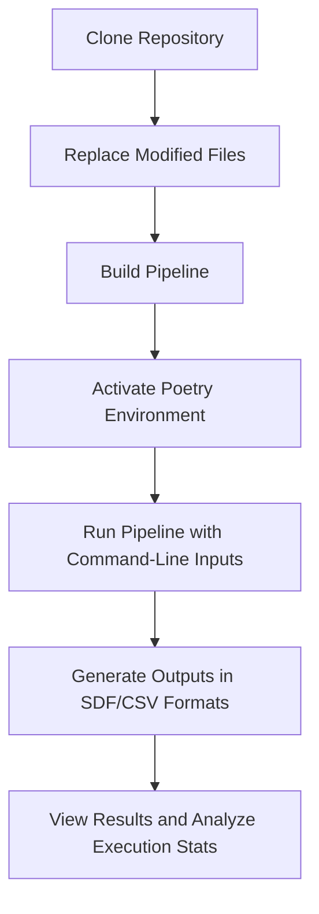

# **Conformer Generation Pipeline Installation Guide**

## **Overview**
This guide provides instructions to set up, install, and execute the modified conformer generation pipeline. The pipeline generates, optimizes, and analyzes chemical conformers using RDKit and additional tools.

---

## **Prerequisites**
1. **Python version**: Ensure Python >= 3.7 is installed.
2. **Package Manager**: Poetry for dependency management.
3. **Libraries**:
   - `rdkit` (via `conda` or pre-built wheels).
   - Other dependencies will be installed via Poetry.

---

## **Installation Steps**



### 1. **Clone the Repository**
```bash
git clone https://github.com/aganitha/crystal-structure.git
cd crystal-structure/conformer_generation_pipeline/atk-conformer-generation-pipeline/atk_conformer_generation_pipeline
```

### 2. **Replace Modified Files**
Replace the files in the original folder structure with the updated files from the `conformer-output-changes` directory:
```bash
# Copy and replace the modified files into the original pipeline structure
cp -r ../conformer-output-changes/* .
```

### 3. **Install Dependencies**
Run the following command to install all required dependencies:
```bash
poetry install
```

### 4. **Build the Pipeline**
Use Poetry to build the pipeline:
```bash
poetry build
```

### 5. **Activate the Environment**
Activate the Poetry environment:
```bash
poetry shell
```

### 6. **Run the Pipeline**
Run the pipeline using the `run_pipeline` command:
```bash
run_pipeline --ref-confo-path "<path_to_reference_conformer>" --inp-smiles "<SMILES_string>" --num-conf <number_of_conformers> --num-clusters <number_of_clusters>
```

**Example:**
```bash
run_pipeline "/path/to/ref_conformer.xyz" "CC(=O)OCC[N+](C)(C)C" --num-conf 1000 --num-clusters 20
```

---

## **Outputs**
1. **Optimized conformers** in SDF format.
2. **Sorted conformers** based on energy in a separate SDF file.
3. **Cluster representatives** in CSV and SDF formats.
4. **RMSD and similarity results** in `.dat` and `.csv` files.
5. **Execution statistics** displayed in the terminal.

---

## **Troubleshooting**

1. **RDKit installation issues**:
   - If RDKit is not installed via Poetry, install it manually using pre-built wheels:
     ```bash
     pip install rdkit-pypi
     ```

2. **File not found errors**:
   - Ensure all files from `conformer-output-changes` are correctly copied to the original pipeline structure.

---
